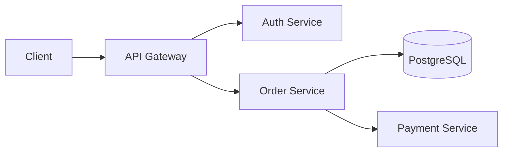

# Documentation Best Practices

## Philosophy

**Document the "Why", not the "What"** - Code shows what happens; docs explain why.

## Documentation as Code - MANDATORY

| Language/Tool | Documentation Tool | Command |
|--------------|-------------------|---------|
| Terraform | terraform-docs | `terraform-docs markdown table .` |
| Go | godoc / pkgsite | `go doc -all ./...` |
| Python | mkdocs / Sphinx | `mkdocs serve` |
| TypeScript | TypeDoc | `npx typedoc src/` |
| API | OpenAPI / Swagger | Generate from code annotations |

**Auto-generate where possible** - Manual docs become stale.

## README Standard - MANDATORY

Every project must have a README with these sections:

```markdown
# Project Name

Brief description (1-2 sentences).

## Features
- Feature 1
- Feature 2

## Requirements
- Runtime: Node.js >= 20
- Database: PostgreSQL >= 15

## Quick Start

```bash
# Install
npm install

# Configure
cp .env.example .env

# Run
npm run dev
```

## Configuration

| Variable | Description | Required | Default |
|----------|-------------|----------|---------|
| `DATABASE_URL` | PostgreSQL connection | Yes | - |
| `PORT` | Server port | No | `3000` |

## Development

```bash
npm run lint    # Lint code
npm test        # Run tests
npm run build   # Build for production
```

## API Reference

See [API Documentation](./docs/api.md).

## Contributing

See [CONTRIBUTING.md](./CONTRIBUTING.md).

## License

MIT
```

## CHANGELOG - MANDATORY for Libraries/APIs

Follow [Keep a Changelog](https://keepachangelog.com/en/1.1.0/) + [Semantic Versioning](https://semver.org/):

```markdown
# Changelog

## [Unreleased]
### Added
- New feature in progress

## [2.1.0] - 2024-01-15
### Added
- User authentication via OAuth2 (#123)

### Changed
- Improved error messages for validation

### Fixed
- Memory leak in connection pool (#124)

### Security
- Updated dependencies to fix CVE-2024-1234

## [2.0.0] - 2024-01-01
### Changed
- **BREAKING**: Renamed `userId` to `user_id` in API responses

### Removed
- Deprecated `v1` API endpoints
```

**Categories:** Added, Changed, Deprecated, Removed, Fixed, Security

## Architecture Decision Records (ADR)

For significant decisions, create an ADR:

```markdown
# ADR-001: Use PostgreSQL for Primary Database

## Status
Accepted | Superseded by ADR-XXX | Deprecated

## Context
What is the issue or decision we need to make?

## Decision
What is our choice?

## Consequences
What are the positive and negative outcomes?

## Alternatives Considered
| Option | Pros | Cons | Decision |
|--------|------|------|----------|
| PostgreSQL | ACID, JSON support | Scaling | ✅ Chosen |
| MongoDB | Flexible schema | No ACID | ❌ Rejected |
```

**Store in:** `docs/adr/` or `docs/decisions/`

## Code Comments

### When to Document

| Scenario | Example |
|----------|---------|
| Non-obvious business logic | Tax calculation rules |
| Design decisions | Why Strategy over Factory |
| Workarounds | Link to issue ticket |
| Complex algorithms | Time/space complexity |
| Security considerations | Why input is sanitized |
| External dependencies | API version constraints |

### When NOT to Document

| Scenario | Why |
|----------|-----|
| Self-explanatory code | Noise |
| Trivial methods | Obvious |
| Implementation details | May change |
| Repeating the code | Redundant |

```python
# ❌ Bad - states the obvious
# Loop through users
for user in users:

# ❌ Bad - repeats the code
# Increment counter by 1
counter += 1

# ✅ Good - explains WHY
# Skip first 2 rows: header + metadata per CSV spec v2.1
start_row = 2

# ✅ Good - explains business rule
# Premium users get 10% discount, capped at $50
# per marketing policy POL-2024-123
discount = min(amount * 0.10, 50)
```

## Docstring Standards by Language

### Python (Google Style)
```python
def process_order(order: Order, user: User) -> OrderResult:
    """Process an order for the given user.

    Validates inventory, applies discounts, and creates payment intent.

    Args:
        order: The order to process.
        user: The user placing the order.

    Returns:
        OrderResult with status and payment details.

    Raises:
        InsufficientInventoryError: If items are out of stock.
        PaymentFailedError: If payment processing fails.

    Example:
        >>> result = process_order(order, user)
        >>> print(result.status)
        'completed'
    """
```

### Go (GoDoc)
```go
// ProcessOrder processes an order for the given user.
//
// It validates inventory, applies discounts, and creates a payment intent.
// Returns an error if inventory is insufficient or payment fails.
//
// Example:
//
//	result, err := ProcessOrder(ctx, order, user)
//	if err != nil {
//	    return fmt.Errorf("order processing failed: %w", err)
//	}
func ProcessOrder(ctx context.Context, order *Order, user *User) (*OrderResult, error) {
```

### TypeScript (TSDoc)
```typescript
/**
 * Processes an order for the given user.
 *
 * @param order - The order to process
 * @param user - The user placing the order
 * @returns Promise resolving to OrderResult with status and payment details
 * @throws {InsufficientInventoryError} If items are out of stock
 * @throws {PaymentFailedError} If payment processing fails
 *
 * @example
 * ```typescript
 * const result = await processOrder(order, user);
 * console.log(result.status); // 'completed'
 * ```
 */
async function processOrder(order: Order, user: User): Promise<OrderResult> {
```

## Diagrams as Code

Use Mermaid for architecture diagrams (renders in GitHub):

```markdown

```

## Documentation Checklist

- [ ] README exists with all required sections
- [ ] CHANGELOG maintained for versioned projects
- [ ] Public APIs have docstrings
- [ ] Complex logic has explanatory comments
- [ ] Architecture decisions documented (ADR)
- [ ] Configuration options documented
- [ ] Examples provided for common use cases
